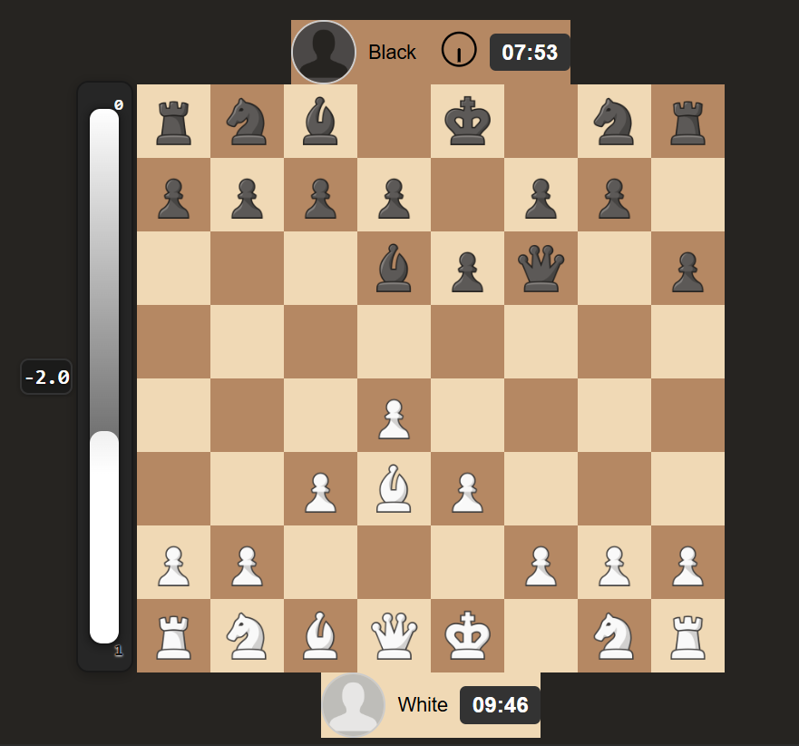

# ♟️ ExtraAjedrez

Proyecto grupal inspirado en Chess.com. El objetivo es replicar funcionalidades principales de la plataforma creando una **aplicación web interactiva** con **Python** y tecnologías web modernas.

---

## 🚀 Objetivos del Proyecto

- Tablero funcional con lógica completa de ajedrez.
- Partidas entre dos jugadores en una misma sesión.
- Interfaz web amigable y visualmente parecida a Chess.com.
- Temporizador, mensajes y animaciones.
- **Comparador de evaluaciones:** Visualización de barra de evaluación de IA propia y Stockfish (en progreso).

---

## 🛠️ Tecnologías Utilizadas

- **Backend:** Python, Flask
- **Frontend:** HTML, CSS, JavaScript

---

## 📅 Roadmap Actual

### ✅ Fase 1: Lógica del Juego
- [x] Representación del tablero (8x8)
- [x] Clases para cada pieza y movimientos
- [x] Validación de movimientos legales
- [x] Detección de jaque y jaque mate
- [x] Detección de tablas (ahogado)

### ✅ Fase 2: Interfaz Web
- [x] Renderizar el tablero en navegador
- [x] Comunicación frontend-backend para los movimientos
- [x] Barra de evaluación de IA propia

### ✅ Fase 3: Mejoras Visuales
- [x] Estilo visual tipo Chess.com
- [x] Temporizador, mensajes y animaciones

---

## 🤖 Desarrollo de la IA Propia en ExtraAjedrez

La inteligencia artificial propia de ExtraAjedrez se basa en algoritmos clásicos de ajedrez y conceptos fundamentales de grafos y árboles:

- **El ajedrez como grafo:** Cada estado del tablero es un nodo y cada movimiento legal es una arista, generando un árbol de posibilidades (árbol de jugadas).
- **Búsqueda en profundidad (DFS) y Minimax con poda alpha-beta:** La IA explora secuencias de movimientos mediante DFS recursivo y selecciona la mejor jugada usando Minimax, optimizando con poda alpha-beta para mayor eficiencia.
- **Función de evaluación heurística:** Cada posición es evaluada considerando factores como material, desarrollo, control del centro, estructura y avance de peones, movilidad, seguridad del rey, amenazas, promociones y pareja de alfiles.
- **Priorización de movimientos:** Los movimientos de captura se exploran primero, mejorando la eficacia de la poda alpha-beta.

**¿Qué logra la IA propia?**

- Evalúa posiciones del tablero de forma integral usando heurísticas clásicas.
- Explora varias jugadas a futuro, simulando el razonamiento de un jugador humano.
- Selecciona la jugada óptima según el análisis del árbol de movimientos.
- Su lógica es extensible y sirve como base para futuros desarrollos de IA en ajedrez.

---

## 📸 Vista Previa

---

## ✨ Autor

Desarrollado por [Armoon01](https://github.com/Armoon01) [NoSoyAng3l](https://github.com/NoSoyAng3l]
Proyecto educativo y de práctica.
